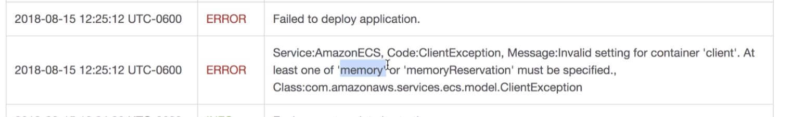

# Dockerizing multiple containers and deploying them for production

Look at the `docker-compose.yml` file in the root directory. Notice how we can't just add `.` anymore since the `docker-compose.yml` file is outside of each application directory (client, server, worker).

Look at how we define volumes for the server container:
```
  volumes:
  - /app/node_modules // lock this so it doesn't look for changes here in the local app
  - ./server:/app // this will watch for changes in the server directory
```
Remember we map the local directory to working directory that we defined in the docker container in `server`'s `Dockerfile.dev`:
```
WORKDIR '/app'
```
So we can tell what to lock INSIDE the docker container, but when we map, we have to map the local directory structure to the working directory structure in the docker container.

## Docker Compose Structure
```
version: 'something'
services:
  postgres:
    image: 'postgres:latests'
    environment:
      - POSTGRES_PASSWORD=postgres_password
  redis:
    image: 'redis:latest'
  server:
    build:
    volumes:
    environment:

```

The `build` part are the build configs to tell docker how to build an image out of our source code. You need to define the context and dockerfile like this:
```
build:
  context: ./server
  dockerfile: Dockerfile.dev
```

## Nginx Routing
We need to configure a file called `default.conf`. It is a file added to nginx image to implement a set of routing rules for nginx. [See image here](./readme-images/nginx-routing.png)

Nginx watches for requests and refers to "upstream servers" that it can redirect request traffic to. These upstream servers cannot be reached until the request hits Nginx first, where Nginx then decides which server the request should be directed.

The port numbers for each upstream servers is defined in each application.

Remember that the different services names defined in `docker-compose.yml` These services names are used as a kind of domain - Nginx can then refer to these domain names to access the service that hosts its application.

See `./nginx/default.conf` for reference.

For api routing, we have something like this:
`rewrite /api/(.*) /$1 break;`

The `/$1` is a reference to whatever was matched in the `(.*)` regex. Then, it will replace `/api/(.*)`.
The `break` keyword is a directive that prevents any further rewrite rules.

Now we need a custom nginx image in its own container to communicate with the other container that contains our app images.

## Dockerfile for Nginx Custom image
See `./nginx/Dockerfile.dev` for reference.

Once we create this dockerfile, we need to add the nginx service to `docker-compose.yml`. Ensure that we have a restart policy because this service is always proxying traffic towards a specific upstream server, so we always want this service up and active:
```
nginx:
    restart: always
    build:
      context: ./nginx
      dockerfile: Dockerfile.dev
    ports:
      - '3050:80'
```

## Starting up Docker Compose
`docker-compose down && docker-compose up --build`: `--build` to force a rebuild when changing docker compose configuration

### TROUBLESHOOTING: There can be an edge case where the nginx upstream connection fails after building the container:


Problem: `connect() failed (111: Connection refused) while connecting to upstream, client:[DOCKER INTERNAL IP], server:, request: "GET / HTTP/1.1", upstream: [NETWORK IP]`

Solution: 
```
 nginx:
    depends_on:
      - api
      - client
```      

When entering application via `localhost:3050`, if you see "I calculated Nothing yet!" for each index entered, we can try:
```
worker:
  environment:
    - REDIS_HOST=redis
    - REDIS_PORT=6379
```
as well as
```
api:
  depends_on:
    - postgres
```
See [depends on](https://docs.docker.com/compose/compose-file/#depends_on) for reference.

We get a websocket error in when starting up the application on `localhost:3050`. This is because we haven't set any websocket communication to go through when we make changes to the local source code. To fix this, we need to do:
```
location /sockjs-node {
    proxy_pass http://client;
    proxy_http_version 1.1;
    proxy_set_header Upgrade $http_upgrade;
    proxy_set_header Connection "Upgrade";
  }
```
in the `/nginx/default.conf` file.

## Finalizing dockerfiles
At this point we can create multiple production `Dockerfile`s. Notice how each of `client`, `server`, `nginx`, and `worker` have `Dockerfile` and `Dockerfile.dev`. The prod `Dockerfile` manages production deployment (See `/nginx` for a clear difference to use the right `.conf` files)

For the client, since this is the UI the user will access, we need to ensure that there is a separate nginx server that serves the react production files and exposes the port to the routing nginx server. This is different than the first nginx (that handles upstream server requests). [See image for details](./readme-images/nginx-for-ui.png)

## Setting up travis.yml and creating aws elastic beanstalk

We will use travis-ci to build dev env apps, run tests, and upon passed tests, build a prod app and push the images to docker hub. Then the elastic beanstalk will be alerted of any future updates to the docker hub.


### Travis CI Flow:

[Diagram here](./readme-images/travis-ci-multi-deployment-flow.png)

```
before_install:
  - docker build -t simmonson/react-test -f ./client/Dockerfile.dev ./client
```

• `-t simmonson/react-test`: tag image with docker id and image name    
• `-f ./client/Dockerfile.dev`: Specify the dockerfile to be used    
• `./client`: The build context. In some dockerfiles, we have previously defined this as `.` because it's in the current root dir.    

Now, we need to specify the nested folder `./client` as the build context - look into the client dir to get the build context

Since we only have tests for the UI, we have just this one line. Here is where you will build more docker images to prep the test step.

### Define script to run

```
script:
  - - docker run -e CI=true simmonson/react-test npm run test -- --coverage
```

• `run -e CI=true simmonson/react-test`: Run the docker container of the specified image. The `-e CI=true` is an update with how [jest works with CRA](https://facebook.github.io/create-react-app/docs/running-tests#linux-macos-bash)    
• We need it to exit with code 0, any other code is a fail. We also need to override the default npm run command with `npm run test`    
• `-- --coverage`: To override the watch mode of `npm run test`, we need these flags to exit upon test completion with a 0 or non 0.    

### After success:
Build images for production by tagging an image name and defining the context:
```
- docker build -t simmonson/multi-client ./client
- docker build -t simmonson/multi-nginx ./nginx
- docker build -t simmonson/multi-server ./server
- docker build -t simmonson/multi-worker ./worker
```

Then, we need to push these images to docker hub. But before that, we need to login via docker CLI. To do this, we can add a step:
```
  # Log in to docker CLI
  - echo "$DOCKER_PASSWORD" | docker login -u "$DOCKER_ID" --password-stdin
```

• `-echo "$DOCKER_PASSWORD"`: Retrieves value stored in travis-ci's env variables and uses it in next cli cmd via `stdin`        
• `docker login -u "$DOCKER_ID"`: use docker CLI to login with the `DOCKER_ID` env variable    
• `--password-stdin`: Expects password to be received (password is the prompt from docker CLI) via stdin, which is from the left hand side of the pipe.    

# Deployment to AWS
We need a `Dockerrun.aws.json` image to handle all the Dockerfiles inside of the root directory. 

AWS Elastic Beanstalk actualy uses AWS Elastic Container Services (ECS) to run containers. You define a single "Task Definition" to run a single container within the AWS ECS as shown 

It's important to utiltize the "Container Definitions" sections of [https://docs.aws.amazon.com/AmazonECS/latest/developerguide/task_definition_parameters.html](https://docs.aws.amazon.com/AmazonECS/latest/developerguide/task_definition_parameters.html) to read the different parameters required when defining container defs.

** Important **
Look at the service names defined in the `docker-compose.yml` file. We have services defined as `postgres`, `redis`, `nginx`, `api`, `client`, and `worker`. By defining these service names, we are creating a new hostname that can be accessed by any other container in the same `docker-compose.yml` file. 

This is why the `nginx`'s `default.conf` allows access to other `location`s via: 
```
location / {
    proxy_pass http://client;
  }

  location /api {
    rewrite /api/(.*) /$1 break;
    proxy_pass http://api;
  }
```
where `http://client` is the hostname (usually it's something like `https://google.com`).

But in the `Dockerrun.aws.json` file, we have to specify a distinct hostname:
```
"containerDefinitions": [
    {
      "name": "client",
      "image": "simmonson/multi-client",
      "hostname": "client"
    }
  ]
```

You can really mess up the container requests by defining `"hostname"` as `"google.com"`.

### More important configs in the Dockerrun.aws.json file
• `essential`: Means the container is either important or not via boolean value. If it is `true` and the container ever crashes, all other containers in the `containerDefinitions` will automatically shut down. At least one of these containers have to be set to `true`.        
• `"portMappings"`: This is similar to `ports` in the `docker-compose.yml` file. We define the `hostPort` as the exposed port of the machine running the containers, and `containerPort` as the exposed port of the container. It's in an array because we can expose multiple ports:    
```
 "portMappings": [
    {
      "hostPort": 80,
      "containerPort": 80
    }
  ]
```      

• `"links"`: Unlike `docker-compose.yml` where each container knows about each other by their service/host names, we need to define the links that go from `nginx` server to its upstream servers:     
```
"links": [
    "client",
    "server"
  ]
```

    

*** PRO TIP - JSON Validator on ECS is not very good, google some JSON validator and validate your `Dockerrun.aws.json` to validate instead ***

## AWS Architecture
Compare the two architectures below. The dev environment is different than production, and we are not simply using AWS EB for deployment:


AWS Elastic Cache and AWS Relational Database Services are unopinionated services that give production benefits for deployment.    

#### The AWS Elastic Cache has the benefits shown below


#### AWS Relational Database Service has greate benefits, especially Automated backups. Setting up automated backups is difficult and can be costly. AWS RDS already has a system that does this for you and can rollback in one or two button clicks:


### When creating an EB Instance...
It is created within a specific region. This example defaulted to Oregon, or `us-west-2`, the technical term for the region. In each of these regions, when creating an EB instance, you get a `Virtual Private Cloud` (VPC).

It is its own private network, so all services and instances created are isolated to just your aws account. The VPC is used for security rules and connecting the different services within the VPC. You automatically get one "default" VPC per region. 

### Security Group
Fancy term for "Firewall rule". This helps with connecting different services within the VPC.

A default security group is created that allows:
• Any incoming traffic on Port 80 from any IP to EB instance


Select the region that your multi-container docker app is in, and head over to `VPC/Security Groups/[SecurityGroupID]`. You will see its inbound rules and the default rules of Port 80 exposed to any IP:

Our security group rule for the services to talk to each other will be:
#### Allow any traffic from any other AWS service that has this security group    


# Creating AWS Relational Database Service
• Search for `RDS` in the management console    
• Click on `RDS`, and click on `Create Database` button    
• Click on the db used (this app is using postgres)    
• Ensure to click "Free tier" under `Templates`. Any aws account over one year old will not qualify for this, even if this option is available    
• Under `Settings` and `Credentials Settings`, type in a master username and password. In our local dev, we defined in our env vars in the api service in `docker-compose.yml`:    
```
api:
  build:
    context: ./server
    dockerfile: Dockerfile.dev
  volumes:
    - /app/node_modules
    - ./server:/app
  environment:
    - REDIS_HOST=redis
    - REDIS_PORT=6379
    - PGUSER=postgres
    - PGHOST=postgres
    - PGDATABASE=postgres
    - PGPASSWORD=postgres_password
    - PGPORT=5432
``` 
Similarly, we want to ensure we remember the master username and password, which will be the env variables in the api service we create and store.

• Under `Connectivity`, ensure our default VPC is selected. We also ideally want Subnet group but we skipped over this for now. Also we want `Publicly Accessible` section to be `No`, because this RDS should only be accessed by our api service. See images below for further config settings that we chose:    


dbname=fibvalues
dbuser=postgres
dbpassword=postgres_password

# Creating AWS Redis Elasticache Service
• Search for `elasticache` in the management console    
• Click on `Elasticache`, then on `Create` button    
• Ensure to choose the lowest/cheapest node type (cache.t2.micro):

• See below for rest of settings. Those settings not shown in images are just the default settings chosen:


Notice we just chose the default security group rules. We will create a new security group rule to achieve our main goal: 
#### Allow any traffic from any other AWS service that has this security group    

## Creating Security Group
Head over to `VPC/SecurityGroups/Create New SecurityGroup`. Our configs for `Basic Details were:


Ensure to choose the default VPC that was created for our EB instance.

Create security group. This is easier to edit inbound rules instead of doing it all at once.

Once created, you can edit `Inbound Rules`. See image below for configs. Ensure source is `custom`, and the security group that was just created is chosen so that only the services that are within this security group can access the ports:


Now that we created the security group, we have to go back to all 3 of our services (api EB instance, RDS Postgres, and Elasticache Redis) and assign the security group to each one.

## Security Group for EC Redis
• Go to Elasticache, click on Redis, select the redis instance created, and click `Actions` dropdown and then `Modify`    
• Click on `VPC Security Group(s)` edit pencil button, and choose the security group we created:

*** PRO TIP - changing security group doesn't need maintenance time, even though the prompt shows maintenance scheduler ***
• Now click `Modify`    

## Security Group for RDS Postgres
• Go to `RDS/Databases` and select the database we created    
• Click `Modify` on the top right button and under `Network & Security`, you can select the custom security group we created:

• Click `Continue`. Next window shows maint scheulder; same pro tip, doesn't need maintenance schedule. Click `Modify DB Instance`. The security groups should be modified after a little while by checking the db instance.    

## Security Group for API Server (EB Instance)
• Go to `Elastic Beanstalk/[name of eb instance]/Configuration(left-hand side)/Instances(Edit)`    
• Under `EC2 Security Groups`, click on the checkbox beside the custom security group we created and click `Apply`    
• At this point, a new page with a warning about the EC2 instance restarting will appear which is what we want because we're not doing anything with this instance yet.    

## Setting Environment Variables
Go to your EB instance (we called in "multi-docker"), and click `Configuration` on the left hand side, then click `Edit` on the `Software` card.
*** PRO TIP - The env variables are not hidden here ***

Below are the key/value pairs for the env variables, and tips on how to get the values:

`REDIS_HOST=[primary-endpoint-from-elasticache-instance]`
Get the primary endpoint by going to `Elasticache/Redis`, opening the dropdown on the ec instance (we called it "multi-docker-redis"), and getting the primary endpoint. The port number is not necessary

`REDIS_PORT=[see-elasticache-instance]`
`PGDATABASE=[see-rds-instance]`
`PGHOST=[should-have-saved-this-when-creating-rds-instance]`
`PGPASSWORD=[should-have-saved-this-when-creating-rds-instance]`
`PGPORT=[see-rds-instance]`
`PGUSER=postgres`

** PRO TIP - When setting these variables on EBS, all the containers listed in the `Dockerrun.aws.json` file has access to these variables, so you don't need to specify env variables for each container **

## IAM Keys for Deployment
Created an IAM user that has all access clicked on `beanstalk` when getting existing user restrictions.

## Travis Deploy Script
Added the below in the `.travis.yml` file:
```
deploy:
  edge: true // issue with travis yml with bucket_name error
  provider: elasticbeanstalk
  region: us-west-2 // region your app is in
  app: multi-docker // name of your eb instance
  env: MultiDocker-env // env name of your eb instance
  bucket_name: elasticbeanstalk-us-west-2-720252850272 // See image for where to get bucket_name
  bucket_paht: docker-multi // we created this name on the spot
  on:
    branch: master
  access_key_id: $AWS_ACCESS_KEY
  secret_access_key: $AWS_SECRET_KEY
```
`bucket_name` here:


If you are getting a persistent missing bucket_name error with a failed build you will need to add the following to your `.travis.yml` file:
```
deploy:
  edge: true
  provider: elasticbeanstalk
  ...
```
What this is doing is forcing Travis to use the v2 (experimental) version of the dpl script which does not have the bug.

## We forgot a param in ther `Dockerrun.aws.json` file!
We need to define memory allocation for each container - how much RAM? We decided 128MB across the board.

Below shows the error shown on aws ebs:


Below is an example of mem allocationin our `Dockerrun.aws.json` file:
```
{
  "name": "client",
  "image": "simmonson/multi-client",
  "hostname": "client",
  "essential": false,
  "memory": 128
}
```


## AWS Config Cheat Sheet below

```
EBS Application Creation

Go to AWS Management Console and use Find Services to search for Elastic Beanstalk

Click “Create Application”

Set Application Name to 'multi-docker'

Scroll down to Platform and select Docker

In Platform Branch, select Multi-Container Docker running on 64bit Amazon Linux

Click Create Application

You may need to refresh, but eventually, you should see a green checkmark underneath Health.

RDS Database Creation

Go to AWS Management Console and use Find Services to search for RDS

Click Create database button

Select PostgreSQL

In Templates, check the Free tier box.

Scroll down to Settings.

Set DB Instance identifier to multi-docker-postgres

Set Master Username to postgres

Set Master Password to postgrespassword and confirm.

Scroll down to Connectivity. Make sure VPC is set to Default VPC

Scroll down to Additional Configuration and click to unhide.

Set Initial database name to fibvalues

Scroll down and click Create Database button

ElastiCache Redis Creation

Go to AWS Management Console and use Find Services to search for ElastiCache

Click Redis in sidebar

Click the Create button

Make sure Cluster Mode Enabled is NOT ticked

In Redis Settings form, set Name to multi-docker-redis

Change Node type to 'cache.t2.micro'

Change Replicas per Shard to 0

Scroll down and click Create button

Creating a Custom Security Group

Go to AWS Management Console and use Find Services to search for VPC

Find the Security section in the left sidebar and click Security Groups

Click Create Security Group button

Set Security group name to multi-docker

Set Description to multi-docker

Make sure VPC is set to default VPC

Click Create Button

Scroll down and click Inbound Rules

Click Edit Rules button

Click Add Rule

Set Port Range to 5432-6379

Click in the box next to Source and start typing 'sg' into the box. Select the Security Group you just created.

Click Create Security Group

Applying Security Groups to ElastiCache

Go to AWS Management Console and use Find Services to search for ElastiCache

Click Redis in Sidebar

Check the box next to Redis cluster

Click Actions and click Modify

Click the pencil icon to edit the VPC Security group. Tick the box next to the new multi-docker group and click Save

Click Modify

Applying Security Groups to RDS

Go to AWS Management Console and use Find Services to search for RDS

Click Databases in Sidebar and check the box next to your instance

Click Modify button

Scroll down to Network and Security and add the new multi-docker security group

Scroll down and click Continue button

Click Modify DB instance button

Applying Security Groups to Elastic Beanstalk

Go to AWS Management Console and use Find Services to search for Elastic Beanstalk

Click Environments in the left sidebar.

Click MultiDocker-env

Click Configuration

In the Instances row, click the Edit button.

Scroll down to EC2 Security Groups and tick box next to multi-docker

Click Apply and Click Confirm

After all the instances restart and go from No Data to Severe, you should see a green checkmark under Health.


Add AWS configuration details to .travis.yml file's deploy script

Set the region. The region code can be found by clicking the region in the toolbar next to your username.
eg: 'us-east-1'

app should be set to the EBS Application Name
eg: 'multi-docker'

env should be set to your EBS Environment name.
eg: 'MultiDocker-env'

Set the bucket_name. This can be found by searching for the S3 Storage service. Click the link for the elasticbeanstalk bucket that matches your region code and copy the name.

eg: 'elasticbeanstalk-us-east-1-923445599289'

Set the bucket_path to 'docker-multi'

Set access_key_id to $AWS_ACCESS_KEY

Set secret_access_key to $AWS_SECRET_KEY

Setting Environment Variables

Go to AWS Management Console and use Find Services to search for Elastic Beanstalk

Click Environments in the left sidebar.

Click MultiDocker-env

Click Configuration

In the Software row, click the Edit button

Scroll down to Environment properties

In another tab Open up ElastiCache, click Redis and check the box next to your cluster. Find the Primary Endpoint and copy that value but omit the :6379

Set REDIS_HOST key to the primary endpoint listed above, remember to omit :6379

Set REDIS_PORT to 6379

Set PGUSER to postgres

Set PGPASSWORD to postgrespassword

In another tab, open up the RDS dashboard, click databases in the sidebar, click your instance and scroll to Connectivity and Security. Copy the endpoint.

Set the PGHOST key to the endpoint value listed above.

Set PGDATABASE to fibvalues

Set PGPORT to 5432

Click Apply button

After all instances restart and go from No Data, to Severe, you should see a green checkmark under Health.

IAM Keys for Deployment

You can use the same IAM User's access and secret keys from the single container app we created earlier.

AWS Keys in Travis

Go to your Travis Dashboard and find the project repository for the application we are working on.

On the repository page, click "More Options" and then "Settings"

Create an AWS_ACCESS_KEY variable and paste your IAM access key

Create an AWS_SECRET_KEY variable and paste your IAM secret key

Deploying App

Make a small change to your src/App.js file in the greeting text.

In the project root, in your terminal run:

git add.
git commit -m “testing deployment"
git push origin master
Go to your Travis Dashboard and check the status of your build.

The status should eventually return with a green checkmark and show "build passing"

Go to your AWS Elasticbeanstalk application

It should say "Elastic Beanstalk is updating your environment"

It should eventually show a green checkmark under "Health". You will now be able to access your application at the external URL provided under the environment name.
```


